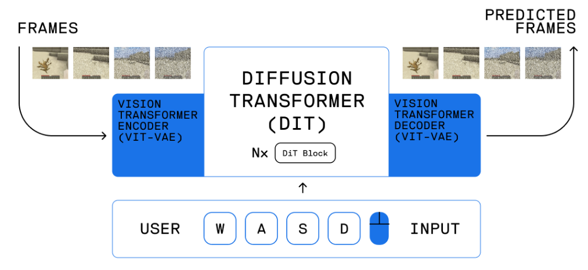

# Model Architecture Overview
<p align="center">
    
    <p align="center">General breakdown of our model and its different components</p>
</p> 

## Layers
1. **ViT-VAE Encoder**  
The ViT-VAE is for processing images to be sent into the DiT. It does no learning itself, just sets up our input to be used within the training model.  
*General Procedure:*  
    - First, we take our starting Pong frame and calculate its computer policy ```action``` using our Pong interface
    - Next, we probe our Pong interface for the ```next frame``` by taking that action
        - This ```next frame``` image is what actually gets fed into the ViT-VAE encoder.
    - Finally, the ViT-VAE encoder converts this image into patches with its ```positional encodings``` to be translated into *latent space*.
        - This latent space is where our learning occurs.
2. **DiT**  
The purpose of the DiT is to denoise images so we can always generate frames even if we were given random static and an arbitrary action.  
*General Procedure:*  
    - First, we need to create a predetermined Gaussian noise function with discrete time steps. This noise will be mixed with our ground truths to train the ```DiT```. 
        - We only need one function, it will be used on each training encoding 
    - Next, we take our ground truth encoding (the ```next frame``` we just encoded), the ```action``` we used to get there, and a randomly sampled ```time step```.
    - We then sample our noise function at that ```time step``` and mix the noise with our ground truth (```next frame```)
    - Finally, the ```DiT``` trains to *remove* the noise based on our ```action``` and outputs a "cleaned" latent space vector to be decoded
        - **To calculate loss,** we compare the **ground truth encoding** to our **DiT trained encoding** in the latent space.
3. **ViT-VAE Decoder**  
After getting the denoised DiT latent space vector, we can then use the ViT-VAE Decoder to decode the latent space vector and turn it back into an RGB frame. During training, we only need to decode if want to see some of the samples or perform pixel-pixel losses.