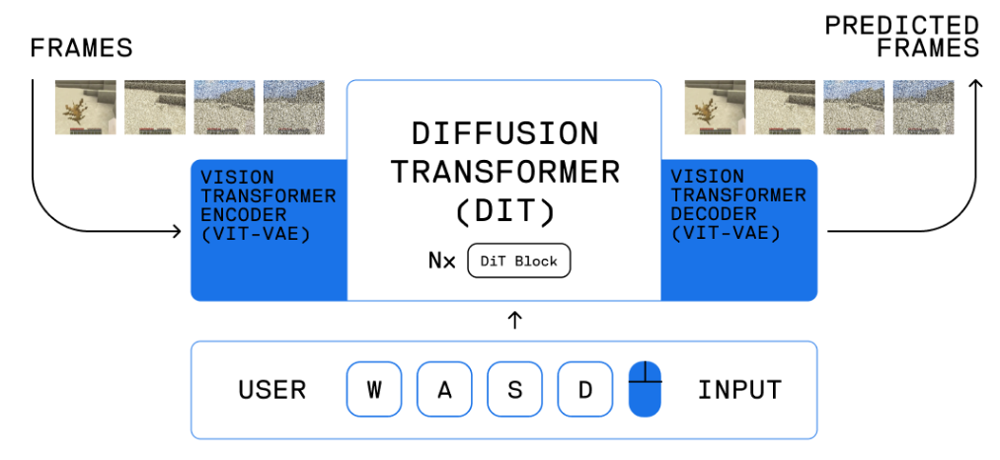
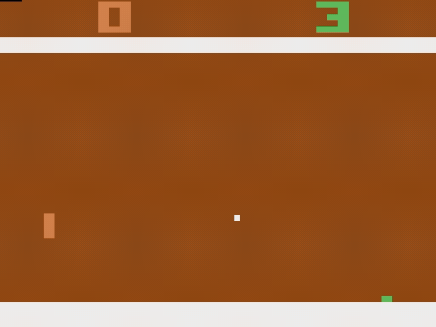

# CV Project 2025
Computer Vision Fall 2025 project for generating frames of Pong or Tetris based off of key board actions in real time.
## Quickstart
Inside the project folder, run the following
- **Windows:**  
``` 
python -m venv venv
.\venv\Scripts\activate
pip install -r requirements.txt  
python main.py -f 300 -e 0.0
```
- **Mac/Linux:**
```
python -m venv venv
source venv/bin/activate
pip install -r requirements.txt
python main.py -f 300 -e 0.0
```
The following commands should open an ALE Atari Pong window with the green paddle playing optimally. The window will close after 5 seconds (300 frames/60FPS = 5s).
## Setup
1. Clone a copy of this repository to your local machine
2. Open a terminal and navigate to the CV_2025 folder
3. Once inside the CV_2025 folder, make a new python environment (this creates a new environment named venv):
    - ``` python -m venv venv ```
4. Activate your environment:
    - Windows: ```.\venv\Scripts\activate```
    - Mac: ```source venv/bin/activate```
5. Once your environment is activated, you should see:
    - Windows: ```(venv) C:\...your folder path...>```
    - Mac: ```(venv) ... $```
6. Now install the required libraries:
    - ```pip install -r requirements.txt```
7. Run commands:
    - Main file: `python main.py [-f FRAMES] [-e EPSILON] [-v] [-p] [-h]`
        - *f: Frames amount (Default 10)*
        - *v: View in window (Default true)*
        - *p: Player keyboard input mode (Default false)*
        - *e: Episolon probability to pick any random move (Default 0.01)*
        - *h: Help*
    - Any file: `python file_name.py`
8. When finished, deactivate your environment:
    - ```deactivate```
    
Add any additional required libraries to the requirements.txt file

## To Do (Big Picture, should be done ASAP)

- [ ] **Set up actual training loop**  
*This should happen in the ```main.py``` or be called there through an external class like ```train.py```*
    - This loop should instantiate our actual model, determine batch size, send and receive inputs to the Pong interface, and train for a specified amount of epochs.
    - Should track loss over time and generate a matplotlib graph with optional dashboarding from Pytorch.
    - Should have a section for inference which does not use gradients
- [ ] **Extract frames from the Pong interface**
    - Right now, we have a Pong class which allows games to be visualized from computer choices or player choices as a demo. We need to implement additional separation or a new function to generate and return the next frame based on deciding the current action from the current frame.
- [ ] **Finish implementing the model**  
    If we follow the OASIS pipeline, we need to make a *3 part system*: ```ViT-VAE Encoder -> DiT -> ViT-VAE Decoder```
      
    1. **ViT-VAE Encoder**  
    The ViT-VAE is for processing images to be sent into the DiT. It does no learning itself, just sets up our input to be used within the training model.  
    *General Procedure:*  
        - First, we take our starting Pong frame and calculate its computer policy ```action``` using our Pong interface
        - Next, we probe our Pong interface for the ```next frame``` by taking that action
            - This ```next frame``` image is what actually gets fed into the ViT-VAE encoder.
        - Finally, the ViT-VAE encoder converts this image into patches with its ```positional encodings``` to be translated into *latent space*.
            - This latent space is where our learning occurs.
    2. **DiT**  
    The purpose of the DiT is to denoise images so we can always generate frames even if we were given random static and an arbitrary action.  
    *General Procedure:*  
        - First, we need to create a predetermined Gaussian noise function with discrete time steps. This noise will be mixed with our ground truths to train the ```DiT```. 
            - We only need one function, it will be used on each training encoding 
        - Next, we take our ground truth encoding (the ```next frame``` we just encoded), the ```action``` we used to get there, and a randomly sampled ```time step```.
        - We then sample our noise function at that ```time step``` and mix the noise with our ground truth (```next frame```)
        - Finally, the ```DiT``` trains to *remove* the noise based on our ```action``` and outputs a "cleaned" latent space vector to be decoded
            - **To calculate loss,** we compare the **ground truth encoding** to our **DiT trained encoding** in the latent space.
    3. **ViT-VAE Decoder**  
    After getting the denoised DiT latent space vector, we can then use the ViT-VAE Decoder to decode the latent space vector and turn it back into an RGB frame. During training, we only need to decode if want to see some of the samples or perform pixel-pixel losses.

## What we've already done
- ✅ **Basic Pong setup**
    - Allows keyboard input for future human playing
    - Has a mode to visualize actions in real time (for our understanding/tests)
    - Uses computer policy to automatically make best moves with a probability to do something random
        - When training, this will allow us to generate games with different levels of "expertise"
    - Has scaffold for using actions from the encoder if implemented in the future
    
- ✅ **First level ViT Encoder creation**
- ✅ **Created a ```main.py``` file**:
    - Inside ```main.py```, we define different command line arguments to parse the following arguments:
        - *f: Frames amount (Default 10)*
        - *v: View in window (Default true)*
        - *p: Player keyboard input mode (Default false)*
        - *e: Episolon probability to pick any random move (Default 0.01)*
        - *h: Help*
    - By default, no training is happening here. This code just calls the Pong interface to view a game with FRAMES length, Computer or Player control, and with an Epsilon probability for the Computer mode.

## Files
| File  | Function |
| ------------- | ------------- |
| decoder.py  | ViT Encoder - Encoding Game Frames  |
| encoder.py  | ViT Decoder + DiT - Reconstruction and Generation  |
| train.py  | Complete Training System  |

## Similar Models
- Oasis Model: https://oasis-model.github.io/
- MineWorld: https://github.com/microsoft/mineworld
- Atari World Modeling: https://arxiv.org/pdf/2405.12399


