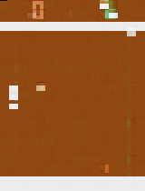

# CV Project 2025
Computer Vision Fall 2025 project for generating frames of Pong or Tetris based off of key board actions in real time.
<p align="center">
    
    <p align=center>Latest DiT generation<br><i>python main.py -f 10000 -t -ae 25 -de 25 -b 32</i></p>
</p>

## Quickstart
Inside the project folder, run the following
- **Windows:**  
``` 
python -m venv venv
.\venv\Scripts\activate
pip install -r requirements.txt  
python main.py -f 300 -e 0.0
```
- **Mac/Linux:**
```
python -m venv venv
source venv/bin/activate
pip install -r requirements.txt
python main.py -f 300 -e 0.0
```
The following commands should open an ALE Atari Pong window with the green paddle playing optimally. The window will close after 5 seconds (300 frames/60FPS = 5s).
## Setup
1. Clone a copy of this repository to your local machine
2. Open a terminal and navigate to the CV_2025 folder
3. Once inside the CV_2025 folder, make a new python environment (this creates a new environment named venv):
    - ``` python -m venv venv ```
4. Activate your environment:
    - Windows: ```.\venv\Scripts\activate```
    - Mac: ```source venv/bin/activate```
5. Once your environment is activated, you should see:
    - Windows: ```(venv) C:\...your folder path...>```
    - Mac: ```(venv) ... $```
6. Now install the required libraries:
    - ```pip install -r requirements.txt```
7. Run commands:
    - Main file: `python main.py [-f FRAMES] [-e EPSILON] [-v] [-p] [-h] [-t] [-ae AE_AMOUNT] [-de DIT_AMOUNT] [-b BATCHES] [-l]`
        - *f: Frames amount (Default 10)*
        - *v: View in window (Default true)*
        - *p: Player keyboard input mode (Default false)*
        - *e: Episolon probability to pick any random move (Default 0.01)*
        - *t: Training mode (Default false, trains both Autoencoder and DiT)*
        - *ae: Autoencoder epoch amount (Default 20)*
        - *de: DiT epoch amount (Default 15)*
        - *b: Batch amount (Default 16)*
        - *l: Load weights from checkpoints (Default false)*
        - *h: Help*
    - Any file: `python file_name.py`
8. When finished, deactivate your environment:
    - ```deactivate```
    
Add any additional required libraries to the requirements.txt file

## To Do (Big Picture, should be done ASAP)

- [ ] **Set up inference section**
    - Inside ```train.py:train``` add a section that test generates one frame based off of the trained **Autoencoder** and **DiT** so we can immediately visualize our model
        - The **DiT** will output the latent space representation of our images, so you will need to ```decode the image``` and convert back to an ``RGB`` image of size ```210x160```
        - *Note: The ALE window is scaled about 4x, so we'll probably need to look into scaling our resolution*
    - Inside ```main.py:main``` complete the ```LOAD``` section so that it opens up a given **weights path** and feeds it into a **DiT** and **Autoencoder** so we can generate frames based off of given weights.
    - Generally speaking, will probably be easier to write a ```decoder.py:generate_frame(start, action)``` function and call it in both sections after each model component has trained weights
- [ ] **Change model to train based off of ```(frame_t, action_t, frame_{t+1})``` tuples**
    - Model should generate the **next frame** conditioned on the given start frame and action, a three-way dependency


## What we've already done
- ✅ **Basic Pong setup**
    - Allows keyboard input for future human playing
    - Has a mode to visualize actions in real time (for our understanding/tests)
    - Uses computer policy to automatically make best moves with a probability to do something random
        - When training, this will allow us to generate games with different levels of "expertise"
    - Has scaffold for using actions from the encoder if implemented in the future
    <p align="center">
    
    </p>  
- ✅ **First level ViT Encoder, DiT, ViT Decoder creation**
- ✅ **Created a ```main.py``` file**:
    - Inside ```main.py```, we define different command line arguments to parse the following arguments:
        - *f: Frames amount (Default 10)*
        - *v: View in window (Default true)*
        - *p: Player keyboard input mode (Default false)*
        - *e: Episolon probability to pick any random move (Default 0.01)*
        - *h: Help*
    - By default, no training is happening here. This code just calls the Pong interface to view a game with FRAMES length, Computer or Player control, and with an Epsilon probability for the Computer mode.
- ✅ **Created a ```train.py``` file**:
    - Inside ```train.py``` we define the different components of our model:
        - *Pong Frame Dataset: Stores frames and actions for the model*
        - *Autoencoder Trainer: Trains our autoencoder with a given decoder*
        - *DiT Trainer: Trains our DiT for frame generation*
        - *train: Callable train loop*
    - Trains model using our data and tracks loss over time with a plot
- ✅ **Extract frames from the ```pong.py``` interface**:
    - Hooked up our pong simulate in the training loop to generate our data from our computer policy


## Files
| File  | Function |
| ------------- | ------------- |
| decoder.py  | ViT Encoder - Encoding Game Frames  |
| encoder.py  | ViT Decoder + DiT - Reconstruction and Generation  |
| train.py  | Complete Training System  |

## Similar Models
- Oasis Model: https://oasis-model.github.io/
- MineWorld: https://github.com/microsoft/mineworld
- Atari World Modeling: https://arxiv.org/pdf/2405.12399


